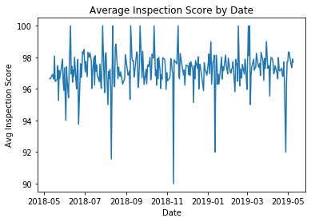
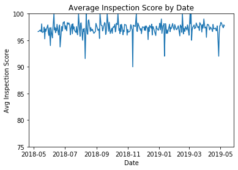

# PANDAS 4EVER

Import 

- pandas under the alias pd 
- datetime under the alias dt
- mayplotlib.pyplot under the alias plt

Run 
- %matplotlib inline

Read in as data
- the csv `FoodServiceData_23_0` in the data folder and assign to the variable `food`


```python

#data manip
import pandas as pd
import datetime as dt

#data viz
import matplotlib.pyplot as plt

#jn to render matplotlib
%matplotlib inline

food = pd.read_csv('data/FoodServiceData_23_0.csv')
```

## Data Exploration and Cleaning

The first question to ask yourself of a dataset: "what is this dataset treating as an observation?"

Think of an "observation" as an "event" or a "subject".  For example, an observation could be a:

- specific subject, like an individual person, with features about that person's characteristics or behaviors: medical data like `blood pressure` or `test results`, econ / sociological data like `yearly income` or `crime rate of neighorhood in which they live`, behavioral data like what products they purchased)

- aggregated subject, like in the Boston housing dataset, where each row was a suburb/town.  Features can be aggregated statistics about things within the region - like `crime rate` or `median house value` - or it can be about the specific region itself, such as `distance to Hahvahd Yahd`

- event, where each row isn't tied to a specific identity but instead tied to a specific action that occured. Often, these types of datasets will have a number of features that act as keys that distinguish events from each other, as well as features containing data about the event. For example, a store with multiple locations might have a dataset of "transactions", where the key features for each row are `Store`, `Time` and `Transaction ID`, with other features `Item Purchased`, `Payment Method`, `Coupons Used`, etc.  Notice that the same type of data - purchasing items - can be organized as either features of a "person" or an "event".

Figuring out which "observation" makes a row is an important part of figuring out how to analyze a dataset.  

Take a look at the first five rows.  How does this dataset appear to be organized?  What is an "observation"?  What are the features?


```python
food.head(5)
```


<div>
<style scoped>
    .dataframe tbody tr th:only-of-type {
        vertical-align: middle;
    }

    .dataframe tbody tr th {
        vertical-align: top;
    }

    .dataframe thead th {
        text-align: right;
    }
</style>
<table border="1" class="dataframe">
  <thead>
    <tr style="text-align: right;">
      <th></th>
      <th>EstablishmentID</th>
      <th>InspectionID</th>
      <th>EstablishmentName</th>
      <th>PlaceName</th>
      <th>Address</th>
      <th>Address2</th>
      <th>City</th>
      <th>State</th>
      <th>Zip</th>
      <th>TypeDescription</th>
      <th>Latitude</th>
      <th>Longitude</th>
      <th>InspectionDate</th>
      <th>Score</th>
      <th>Grade</th>
      <th>NameSearch</th>
      <th>Intersection</th>
    </tr>
  </thead>
  <tbody>
    <tr>
      <td>0</td>
      <td>73002</td>
      <td>1386666</td>
      <td>JU-LI CREATIONS</td>
      <td>NaN</td>
      <td>8621 HI VIEW LN</td>
      <td>NaN</td>
      <td>LOUISVILLE</td>
      <td>KY</td>
      <td>40272</td>
      <td>CATERERS</td>
      <td>38.1212</td>
      <td>0.0000</td>
      <td>2018-06-08 00:00:00</td>
      <td>100.0</td>
      <td>A</td>
      <td>JU-LI CREATIONS</td>
      <td>NaN</td>
    </tr>
    <tr>
      <td>1</td>
      <td>41292</td>
      <td>1386726</td>
      <td>OLE HICKORY PIT BAR B Q</td>
      <td>NaN</td>
      <td>6106 OLD SHEPHERDSVILLE RD</td>
      <td>NaN</td>
      <td>LOUISVILLE</td>
      <td>KY</td>
      <td>40228</td>
      <td>FOOD SERVICE</td>
      <td>38.1628</td>
      <td>-85.6604</td>
      <td>2018-05-21 00:00:00</td>
      <td>NaN</td>
      <td>NaN</td>
      <td>OLE HICKORY PIT BAR B Q</td>
      <td>NaN</td>
    </tr>
    <tr>
      <td>2</td>
      <td>41292</td>
      <td>1386727</td>
      <td>OLE HICKORY PIT BAR B Q</td>
      <td>NaN</td>
      <td>6106 OLD SHEPHERDSVILLE RD</td>
      <td>NaN</td>
      <td>LOUISVILLE</td>
      <td>KY</td>
      <td>40228</td>
      <td>FOOD SERVICE</td>
      <td>38.1628</td>
      <td>-85.6604</td>
      <td>2018-06-05 00:00:00</td>
      <td>NaN</td>
      <td>NaN</td>
      <td>OLE HICKORY PIT BAR B Q</td>
      <td>NaN</td>
    </tr>
    <tr>
      <td>3</td>
      <td>90821</td>
      <td>1386729</td>
      <td>SONIC DRIVE-IN</td>
      <td>NaN</td>
      <td>8600 AMBROSSE LN</td>
      <td>NaN</td>
      <td>LOUISVILLE</td>
      <td>KY</td>
      <td>40299</td>
      <td>FOOD SERVICE</td>
      <td>38.1961</td>
      <td>-85.6030</td>
      <td>2018-06-07 00:00:00</td>
      <td>NaN</td>
      <td>NaN</td>
      <td>SONIC DRIVE-IN</td>
      <td>NaN</td>
    </tr>
    <tr>
      <td>4</td>
      <td>75560</td>
      <td>1386745</td>
      <td>PROOF ON MAIN</td>
      <td>NaN</td>
      <td>702 W MAIN ST</td>
      <td>NaN</td>
      <td>LOUISVILLE</td>
      <td>KY</td>
      <td>40202</td>
      <td>FOOD SERVICE</td>
      <td>38.2570</td>
      <td>-85.7618</td>
      <td>2018-06-12 00:00:00</td>
      <td>100.0</td>
      <td>A</td>
      <td>PROOF ON MAIN</td>
      <td>NaN</td>
    </tr>
  </tbody>
</table>
</div>


Which have nulls in them?


```python

food.info()
```

    <class 'pandas.core.frame.DataFrame'>
    RangeIndex: 9809 entries, 0 to 9808
    Data columns (total 17 columns):
    EstablishmentID      9809 non-null int64
    InspectionID         9809 non-null int64
    EstablishmentName    9809 non-null object
    PlaceName            0 non-null float64
    Address              9809 non-null object
    Address2             0 non-null float64
    City                 9809 non-null object
    State                9809 non-null object
    Zip                  9809 non-null int64
    TypeDescription      9809 non-null object
    Latitude             9809 non-null float64
    Longitude            9809 non-null float64
    InspectionDate       9809 non-null object
    Score                8090 non-null float64
    Grade                6271 non-null object
    NameSearch           9809 non-null object
    Intersection         0 non-null float64
    dtypes: float64(6), int64(3), object(8)
    memory usage: 1.3+ MB


#### There are 3 features that are all nulls, let's get rid of them.

**First**, use a method to drop a specific column.  **Then**, for the other two, use a method that will drop all columns that are completely null. 

Check that only those columns were dropped.


```python

food.drop('PlaceName', axis=1, inplace=True)

food.dropna(axis=1, how='all', inplace=True)

food.info()
```

    <class 'pandas.core.frame.DataFrame'>
    RangeIndex: 9809 entries, 0 to 9808
    Data columns (total 14 columns):
    EstablishmentID      9809 non-null int64
    InspectionID         9809 non-null int64
    EstablishmentName    9809 non-null object
    Address              9809 non-null object
    City                 9809 non-null object
    State                9809 non-null object
    Zip                  9809 non-null int64
    TypeDescription      9809 non-null object
    Latitude             9809 non-null float64
    Longitude            9809 non-null float64
    InspectionDate       9809 non-null object
    Score                8090 non-null float64
    Grade                6271 non-null object
    NameSearch           9809 non-null object
    dtypes: float64(3), int64(3), object(8)
    memory usage: 1.0+ MB


#### For now, let's only look at rows w/ values in the `Score` column

Drop all rows w/ nulls for `Score`.  Make sure you print out how many rows there are pre-drop, how many you dropped, and how many there are after dropping!


```python

print(f'# of rows predrop: {len(food)}')
print(f'# of nulls to drop: {food["Score"].isnull().sum()}')
food.drop(
    food[
        food['Score'].isnull()==True
    ].index, 
    axis=0, 
    inplace=True
)
print(f'# of rows postdrop: {len(food)}')
```

    # of rows predrop: 9809
    # of nulls to drop: 1719
    # of rows postdrop: 8090


#### Looks like there might be a relationship in nulls b/t `Score` and `Grade`

Do all the nulls of `Score` also have nulls for `Grade`? Vice versa?


```python

mask = (
    (food.Score.notnull()) &
    (food.Grade.isnull())
)

print(f'Obs w/ Score and no Grade: {len(food[mask])}')

mask = (
    (food.Score.isnull()) &
    (food.Grade.notnull())
)

print(f'Obs w/ Grade and no Score: {len(food[mask])}')
```

    Obs w/ Score and no Grade: 1819
    Obs w/ Grade and no Score: 0


#### Let's see if we can fill in those `Grade` values from `Score`

How does `Grade` map onto `Score`?  Let's find the rows that have both `Grade` and `Score` values, group by `Grade`, and see the min, max and mean for `Score` for each `Grade`


```python

food_grade = food[food['Grade'].notnull()==True]

food_grade.groupby('Grade')['Score'].min()
food_grade.groupby('Grade')['Score'].max()
food_grade.groupby('Grade')['Score'].mean()
food_grade.groupby('Grade')['Score'].agg(['count', min,'mean', 'std','median',max])
```


<div>
<style scoped>
    .dataframe tbody tr th:only-of-type {
        vertical-align: middle;
    }

    .dataframe tbody tr th {
        vertical-align: top;
    }

    .dataframe thead th {
        text-align: right;
    }
</style>
<table border="1" class="dataframe">
  <thead>
    <tr style="text-align: right;">
      <th></th>
      <th>count</th>
      <th>min</th>
      <th>mean</th>
      <th>std</th>
      <th>median</th>
      <th>max</th>
    </tr>
    <tr>
      <th>Grade</th>
      <th></th>
      <th></th>
      <th></th>
      <th></th>
      <th></th>
      <th></th>
    </tr>
  </thead>
  <tbody>
    <tr>
      <td>A</td>
      <td>5986</td>
      <td>87.0</td>
      <td>97.655028</td>
      <td>2.466370</td>
      <td>98.0</td>
      <td>100.0</td>
    </tr>
    <tr>
      <td>B</td>
      <td>32</td>
      <td>90.0</td>
      <td>98.531250</td>
      <td>2.047569</td>
      <td>99.0</td>
      <td>100.0</td>
    </tr>
    <tr>
      <td>C</td>
      <td>253</td>
      <td>58.0</td>
      <td>84.837945</td>
      <td>7.896241</td>
      <td>87.0</td>
      <td>96.0</td>
    </tr>
  </tbody>
</table>
</div>


#### Whelp.  Let's just drop `Grade` then


```python

food.drop('Grade', axis=1, inplace=True)
```

#### Let's familiarize ourselves with the levels of the categories for the features that are object types


```python

for column in food.select_dtypes('object'):
    print(food[column].value_counts())
```

    SUBWAY                    76
    MCDONALD'S                57
    WENDYS                    40
    EL NOPAL                  37
    TACO BELL                 36
                              ..
    FISCAL COURT SNACK BAR     1
    DANA HOLDING CO.           1
    CANDLEWOOD SUITES          1
    HOLY SPIRIT CONCESSION     1
    NEIGHBORHOOD MART          1
    Name: EstablishmentName, Length: 3241, dtype: int64
    1 ARENA PLAZA          99
    937 PHILLIPS LN        98
    2800 S FLOYD ST        92
    5000 SHELBYVILLE RD    63
    700 CENTRAL AVE        49
                           ..
    6109 BARDSTOWN RD       1
    900 E MARKET ST         1
    700 W OAK ST            1
    6900 DIXIE HWY          1
    7207 FEGENBUSH LN       1
    Name: Address, Length: 3049, dtype: int64
    LOUISVILLE       7914
    PROSPECT          111
    FAIRDALE           52
    MASONIC HOME        5
    PROPSECT            4
    HARRODS CREEK       4
    Name: City, dtype: int64
    KY    8090
    Name: State, dtype: int64
    FOOD SERVICE                                  4699
    RETAIL-FOOD  10,000 SQ FT OR LESS             1378
    FOOD SERVICE (DAY CARE / CHILD CARE CENTER     486
    SCHOOL CAFETERIA OR FOOD SERVICE               407
    PRE-PACKAGED RETAIL                            369
    RETAIL-FOOD  10,001 SQ FT OR OVER              259
    FOOD SERVICE (HOSPITAL / NURSING HOME          110
    STATIONARY RESTRICTED CONCESSON                 90
    CATERERS                                        85
    SUPERMARKET WITH PROCESSING                     82
    RETAIL WITH LIMITED SERVICE                     41
    FOOD SERVICE COMMISSARY                         39
    RETAIL BAKERY                                   24
    HOME (CONTINENTAL BREAKFAST)                     6
    HOME (FULL BREAKFAST)                            3
    CONFINEMENT FACILITY FOOD SERVICE                2
    SALVAGE DISTRIBUTOR                              2
    INN (FULL BREAKFAST)                             2
    SELF-CONTAINED MOBILE FOOD UNITS                 2
    MOBILE RESTRICTED CONCESSION                     2
    CHARITABLE FOOD SERVICE (501(C)3 EXEMPT)         2
    Name: TypeDescription, dtype: int64
    2019-04-17 00:00:00    60
    2019-01-22 00:00:00    59
    2019-03-26 00:00:00    57
    2019-05-06 00:00:00    57
    2019-02-14 00:00:00    56
                           ..
    2018-06-10 00:00:00     1
    2018-08-05 00:00:00     1
    2019-01-12 00:00:00     1
    2018-07-08 00:00:00     1
    2018-06-03 00:00:00     1
    Name: InspectionDate, Length: 275, dtype: int64
    A    5986
    C     253
    B      32
    Name: Grade, dtype: int64
    SUBWAY                    76
    MCDONALD'S                57
    WENDYS                    40
    EL NOPAL                  37
    TACO BELL                 36
                              ..
    FISCAL COURT SNACK BAR     1
    DANA HOLDING CO.           1
    CANDLEWOOD SUITES          1
    HOLY SPIRIT CONCESSION     1
    NEIGHBORHOOD MART          1
    Name: NameSearch, Length: 3241, dtype: int64


#### Do you see some columns that might be duplicated?

Test to see if they're identical


```python

(food.EstablishmentName==food.NameSearch).value_counts()
```


    True    8090
    dtype: int64


#### Of the two identical columns, drop the one that comes second


```python
food.drop('NameSearch', axis=1, inplace=True)
```

#### Let's inspect the `InspectionDate` column

What type is it?


```python

type(food['InspectionDate'][0])
```


    str


Convert the column to datetime object


```python

food['InspectionDate'] = pd.to_datetime(food['InspectionDate'])

food['InspectionDate'].dtype
```


    dtype('<M8[ns]')


## Data Manipulation

#### Let's keep working with that `InspectionDate` column

Create a column that shows the day of inspection


```python

food['InspectionDay'] = food['InspectionDate'].dt.day_name()

food.head()
```


<div>
<style scoped>
    .dataframe tbody tr th:only-of-type {
        vertical-align: middle;
    }

    .dataframe tbody tr th {
        vertical-align: top;
    }

    .dataframe thead th {
        text-align: right;
    }
</style>
<table border="1" class="dataframe">
  <thead>
    <tr style="text-align: right;">
      <th></th>
      <th>EstablishmentID</th>
      <th>InspectionID</th>
      <th>EstablishmentName</th>
      <th>Address</th>
      <th>City</th>
      <th>State</th>
      <th>Zip</th>
      <th>TypeDescription</th>
      <th>Latitude</th>
      <th>Longitude</th>
      <th>InspectionDate</th>
      <th>Score</th>
      <th>Grade</th>
      <th>InspectionDay</th>
    </tr>
  </thead>
  <tbody>
    <tr>
      <td>0</td>
      <td>73002</td>
      <td>1386666</td>
      <td>JU-LI CREATIONS</td>
      <td>8621 HI VIEW LN</td>
      <td>LOUISVILLE</td>
      <td>KY</td>
      <td>40272</td>
      <td>CATERERS</td>
      <td>38.1212</td>
      <td>0.0000</td>
      <td>2018-06-08</td>
      <td>100.0</td>
      <td>A</td>
      <td>Friday</td>
    </tr>
    <tr>
      <td>4</td>
      <td>75560</td>
      <td>1386745</td>
      <td>PROOF ON MAIN</td>
      <td>702 W MAIN ST</td>
      <td>LOUISVILLE</td>
      <td>KY</td>
      <td>40202</td>
      <td>FOOD SERVICE</td>
      <td>38.2570</td>
      <td>-85.7618</td>
      <td>2018-06-12</td>
      <td>100.0</td>
      <td>A</td>
      <td>Tuesday</td>
    </tr>
    <tr>
      <td>14</td>
      <td>90128</td>
      <td>1380419</td>
      <td>QDOBA #2632</td>
      <td>312 S 4TH ST</td>
      <td>LOUISVILLE</td>
      <td>KY</td>
      <td>40202</td>
      <td>FOOD SERVICE</td>
      <td>38.2534</td>
      <td>-85.7572</td>
      <td>2018-05-18</td>
      <td>94.0</td>
      <td>A</td>
      <td>Friday</td>
    </tr>
    <tr>
      <td>15</td>
      <td>88441</td>
      <td>1380420</td>
      <td>POTTER'S HOUSE CHILDCARE ENRICHMENT</td>
      <td>314 S WENZEL ST</td>
      <td>LOUISVILLE</td>
      <td>KY</td>
      <td>40204</td>
      <td>FOOD SERVICE (DAY CARE / CHILD CARE CENTER</td>
      <td>38.2508</td>
      <td>-85.7345</td>
      <td>2018-05-18</td>
      <td>93.0</td>
      <td>A</td>
      <td>Friday</td>
    </tr>
    <tr>
      <td>16</td>
      <td>93095</td>
      <td>1380462</td>
      <td>MANSION MILLIONAIRE 6</td>
      <td>700 CENTRAL AVE</td>
      <td>LOUISVILLE</td>
      <td>KY</td>
      <td>40208</td>
      <td>FOOD SERVICE</td>
      <td>38.2023</td>
      <td>-85.7701</td>
      <td>2018-05-18</td>
      <td>100.0</td>
      <td>A</td>
      <td>Friday</td>
    </tr>
  </tbody>
</table>
</div>


#### Get mean score per day


```python
food.groupby('InspectionDate')['Score'].mean()
```


    InspectionDate
    2018-05-10    96.642857
    2018-05-11    96.652174
    2018-05-14    96.925926
    2018-05-15    96.735294
    2018-05-16    96.620690
                    ...    
    2019-05-03    98.333333
    2019-05-06    97.508772
    2019-05-07    97.357143
    2019-05-08    97.894737
    2019-05-09    97.700000
    Name: Score, Length: 275, dtype: float64


#### Graph!

Give it a title "Average Inspection Score by Date"

Label the axes "Date" and "Avg Inspection Score"


```python
date_means = food.groupby('InspectionDate')['Score'].mean()

fig, ax = plt.subplots()

ax.plot(date_means.index, date_means)
ax.set_xlabel('Date')
ax.set_ylabel('Avg Inspection Score')
ax.set_title('Average Inspection Score by Date')
plt.show()
```





#### Let's say we wanted to compare it to a city that had scores that dropped down to 80

Re-set the scale of the y-axis so it starts at 75 and ends at 100.  Re-graph.


```python
date_means = food.groupby('InspectionDate')['Score'].mean()

fig, ax = plt.subplots()

#chart data
ax.plot(date_means.index, date_means)
ax.set_ylim(75,100)

#chart metadata
ax.set_xlabel('Date')
ax.set_ylabel('Avg Inspection Score')
ax.set_title('Average Inspection Score by Date')
plt.show()
```





Let's see how `Score` breaks down by `TypeDescription`.

Create two columns, one whose value is the mean `Score` of the `TypeDescription` value for that row, one whose value is the std of `Score`
- Groupby `TypeDescription` and calc the mean and std of `Score` 
- Merge with `Food` on `TypeDescription` value


```python

type_means = food.groupby('TypeDescription')['Score'].agg(['mean', 'std'])

type_means = type_means.rename(columns={'mean':'TypeDescription_Mean','std':'TypeDescription_Std'})
# type_means.rename('TypeDescription Mean', inplace=True)

food = pd.merge(food, 
         type_means, 
         left_on='TypeDescription', 
         right_index=True,
        )

food.head()
```


<div>
<style scoped>
    .dataframe tbody tr th:only-of-type {
        vertical-align: middle;
    }

    .dataframe tbody tr th {
        vertical-align: top;
    }

    .dataframe thead th {
        text-align: right;
    }
</style>
<table border="1" class="dataframe">
  <thead>
    <tr style="text-align: right;">
      <th></th>
      <th>EstablishmentID</th>
      <th>InspectionID</th>
      <th>EstablishmentName</th>
      <th>Address</th>
      <th>City</th>
      <th>State</th>
      <th>Zip</th>
      <th>TypeDescription</th>
      <th>Latitude</th>
      <th>Longitude</th>
      <th>InspectionDate</th>
      <th>Score</th>
      <th>Grade</th>
      <th>InspectionDay</th>
      <th>TypeDescription_Mean</th>
      <th>TypeDescription_Std</th>
    </tr>
  </thead>
  <tbody>
    <tr>
      <td>0</td>
      <td>73002</td>
      <td>1386666</td>
      <td>JU-LI CREATIONS</td>
      <td>8621 HI VIEW LN</td>
      <td>LOUISVILLE</td>
      <td>KY</td>
      <td>40272</td>
      <td>CATERERS</td>
      <td>38.1212</td>
      <td>0.0000</td>
      <td>2018-06-08</td>
      <td>100.0</td>
      <td>A</td>
      <td>Friday</td>
      <td>98.305882</td>
      <td>2.19319</td>
    </tr>
    <tr>
      <td>45</td>
      <td>102648</td>
      <td>1387088</td>
      <td>DINING WITH GABOR AND MORE</td>
      <td>1812 W MUHAMMAD ALI BLVD</td>
      <td>LOUISVILLE</td>
      <td>KY</td>
      <td>40203</td>
      <td>CATERERS</td>
      <td>38.2535</td>
      <td>-85.7816</td>
      <td>2018-06-12</td>
      <td>99.0</td>
      <td>A</td>
      <td>Tuesday</td>
      <td>98.305882</td>
      <td>2.19319</td>
    </tr>
    <tr>
      <td>58</td>
      <td>93324</td>
      <td>1383273</td>
      <td>GITA'S CATERING AT HOLIDAY INN</td>
      <td>6551 PARAMOUNT PARK DR</td>
      <td>LOUISVILLE</td>
      <td>KY</td>
      <td>40213</td>
      <td>CATERERS</td>
      <td>38.1541</td>
      <td>-85.7122</td>
      <td>2018-05-30</td>
      <td>96.0</td>
      <td>A</td>
      <td>Wednesday</td>
      <td>98.305882</td>
      <td>2.19319</td>
    </tr>
    <tr>
      <td>114</td>
      <td>70057</td>
      <td>1378470</td>
      <td>SINCERELY YOURS CATERING</td>
      <td>1515 CYPRESS ST</td>
      <td>LOUISVILLE</td>
      <td>KY</td>
      <td>40211</td>
      <td>CATERERS</td>
      <td>38.2300</td>
      <td>0.0000</td>
      <td>2018-05-10</td>
      <td>99.0</td>
      <td>A</td>
      <td>Thursday</td>
      <td>98.305882</td>
      <td>2.19319</td>
    </tr>
    <tr>
      <td>134</td>
      <td>86636</td>
      <td>1378944</td>
      <td>GRACIOUS PLENTY CATERING</td>
      <td>2900 BROWNSBORO RD</td>
      <td>LOUISVILLE</td>
      <td>KY</td>
      <td>40206</td>
      <td>CATERERS</td>
      <td>38.2600</td>
      <td>-85.6881</td>
      <td>2018-05-14</td>
      <td>100.0</td>
      <td>A</td>
      <td>Monday</td>
      <td>98.305882</td>
      <td>2.19319</td>
    </tr>
  </tbody>
</table>
</div>


Calculate a new column that's difference between an inspections's `Score` and its `TypeDescription_Mean` in units of `TypeDescription_Std`


```python

food['TypeDescription_Spread'] = (
    (food['Score']-food['TypeDescription_Mean'])/food['TypeDescription_Std']
    )


food.head()
```


<div>
<style scoped>
    .dataframe tbody tr th:only-of-type {
        vertical-align: middle;
    }

    .dataframe tbody tr th {
        vertical-align: top;
    }

    .dataframe thead th {
        text-align: right;
    }
</style>
<table border="1" class="dataframe">
  <thead>
    <tr style="text-align: right;">
      <th></th>
      <th>EstablishmentID</th>
      <th>InspectionID</th>
      <th>EstablishmentName</th>
      <th>Address</th>
      <th>City</th>
      <th>State</th>
      <th>Zip</th>
      <th>TypeDescription</th>
      <th>Latitude</th>
      <th>Longitude</th>
      <th>InspectionDate</th>
      <th>Score</th>
      <th>Grade</th>
      <th>InspectionDay</th>
      <th>TypeDescription_Mean</th>
      <th>TypeDescription_Std</th>
      <th>TypeDescription_Spread</th>
    </tr>
  </thead>
  <tbody>
    <tr>
      <td>0</td>
      <td>73002</td>
      <td>1386666</td>
      <td>JU-LI CREATIONS</td>
      <td>8621 HI VIEW LN</td>
      <td>LOUISVILLE</td>
      <td>KY</td>
      <td>40272</td>
      <td>CATERERS</td>
      <td>38.1212</td>
      <td>0.0000</td>
      <td>2018-06-08</td>
      <td>100.0</td>
      <td>A</td>
      <td>Friday</td>
      <td>98.305882</td>
      <td>2.19319</td>
      <td>0.772444</td>
    </tr>
    <tr>
      <td>45</td>
      <td>102648</td>
      <td>1387088</td>
      <td>DINING WITH GABOR AND MORE</td>
      <td>1812 W MUHAMMAD ALI BLVD</td>
      <td>LOUISVILLE</td>
      <td>KY</td>
      <td>40203</td>
      <td>CATERERS</td>
      <td>38.2535</td>
      <td>-85.7816</td>
      <td>2018-06-12</td>
      <td>99.0</td>
      <td>A</td>
      <td>Tuesday</td>
      <td>98.305882</td>
      <td>2.19319</td>
      <td>0.316488</td>
    </tr>
    <tr>
      <td>58</td>
      <td>93324</td>
      <td>1383273</td>
      <td>GITA'S CATERING AT HOLIDAY INN</td>
      <td>6551 PARAMOUNT PARK DR</td>
      <td>LOUISVILLE</td>
      <td>KY</td>
      <td>40213</td>
      <td>CATERERS</td>
      <td>38.1541</td>
      <td>-85.7122</td>
      <td>2018-05-30</td>
      <td>96.0</td>
      <td>A</td>
      <td>Wednesday</td>
      <td>98.305882</td>
      <td>2.19319</td>
      <td>-1.051383</td>
    </tr>
    <tr>
      <td>114</td>
      <td>70057</td>
      <td>1378470</td>
      <td>SINCERELY YOURS CATERING</td>
      <td>1515 CYPRESS ST</td>
      <td>LOUISVILLE</td>
      <td>KY</td>
      <td>40211</td>
      <td>CATERERS</td>
      <td>38.2300</td>
      <td>0.0000</td>
      <td>2018-05-10</td>
      <td>99.0</td>
      <td>A</td>
      <td>Thursday</td>
      <td>98.305882</td>
      <td>2.19319</td>
      <td>0.316488</td>
    </tr>
    <tr>
      <td>134</td>
      <td>86636</td>
      <td>1378944</td>
      <td>GRACIOUS PLENTY CATERING</td>
      <td>2900 BROWNSBORO RD</td>
      <td>LOUISVILLE</td>
      <td>KY</td>
      <td>40206</td>
      <td>CATERERS</td>
      <td>38.2600</td>
      <td>-85.6881</td>
      <td>2018-05-14</td>
      <td>100.0</td>
      <td>A</td>
      <td>Monday</td>
      <td>98.305882</td>
      <td>2.19319</td>
      <td>0.772444</td>
    </tr>
  </tbody>
</table>
</div>


Find the values of `EstablishmentName` of the 20 inspections whose `Score` most exceeds its `TypeDescrition_Mean`


```python

(
    food
    .sort_values('TypeDescription_Spread', ascending=False)
    [['EstablishmentName', 'TypeDescription']]
    .reset_index(drop=True)
    [0:20]
)
```


<div>
<style scoped>
    .dataframe tbody tr th:only-of-type {
        vertical-align: middle;
    }

    .dataframe tbody tr th {
        vertical-align: top;
    }

    .dataframe thead th {
        text-align: right;
    }
</style>
<table border="1" class="dataframe">
  <thead>
    <tr style="text-align: right;">
      <th></th>
      <th>EstablishmentName</th>
      <th>TypeDescription</th>
    </tr>
  </thead>
  <tbody>
    <tr>
      <td>0</td>
      <td>KROGER L-360</td>
      <td>RETAIL-FOOD  10,001 SQ FT OR OVER</td>
    </tr>
    <tr>
      <td>1</td>
      <td>KROGER L-764</td>
      <td>RETAIL-FOOD  10,001 SQ FT OR OVER</td>
    </tr>
    <tr>
      <td>2</td>
      <td>KROGER L-707</td>
      <td>RETAIL-FOOD  10,001 SQ FT OR OVER</td>
    </tr>
    <tr>
      <td>3</td>
      <td>KROGER L-346</td>
      <td>RETAIL-FOOD  10,001 SQ FT OR OVER</td>
    </tr>
    <tr>
      <td>4</td>
      <td>KROGER L-379</td>
      <td>RETAIL-FOOD  10,001 SQ FT OR OVER</td>
    </tr>
    <tr>
      <td>5</td>
      <td>KROGER L-707</td>
      <td>RETAIL-FOOD  10,001 SQ FT OR OVER</td>
    </tr>
    <tr>
      <td>6</td>
      <td>MEIJER #166</td>
      <td>RETAIL-FOOD  10,001 SQ FT OR OVER</td>
    </tr>
    <tr>
      <td>7</td>
      <td>TARGET T-2473 STARBUCKS</td>
      <td>RETAIL-FOOD  10,001 SQ FT OR OVER</td>
    </tr>
    <tr>
      <td>8</td>
      <td>TARGET T-2473 STARBUCKS</td>
      <td>RETAIL-FOOD  10,001 SQ FT OR OVER</td>
    </tr>
    <tr>
      <td>9</td>
      <td>KROGER L-389</td>
      <td>RETAIL-FOOD  10,001 SQ FT OR OVER</td>
    </tr>
    <tr>
      <td>10</td>
      <td>GORDON FOOD SERVICE MARKETPLACE</td>
      <td>RETAIL-FOOD  10,001 SQ FT OR OVER</td>
    </tr>
    <tr>
      <td>11</td>
      <td>GORDON FOOD SERVICE MARKETPLACE</td>
      <td>RETAIL-FOOD  10,001 SQ FT OR OVER</td>
    </tr>
    <tr>
      <td>12</td>
      <td>KROGER L-387</td>
      <td>RETAIL-FOOD  10,001 SQ FT OR OVER</td>
    </tr>
    <tr>
      <td>13</td>
      <td>WHOLE FOODS MARKET</td>
      <td>RETAIL-FOOD  10,001 SQ FT OR OVER</td>
    </tr>
    <tr>
      <td>14</td>
      <td>KROGER L-707</td>
      <td>RETAIL-FOOD  10,001 SQ FT OR OVER</td>
    </tr>
    <tr>
      <td>15</td>
      <td>VALU MARKET</td>
      <td>RETAIL-FOOD  10,001 SQ FT OR OVER</td>
    </tr>
    <tr>
      <td>16</td>
      <td>KROGER L-339</td>
      <td>RETAIL-FOOD  10,001 SQ FT OR OVER</td>
    </tr>
    <tr>
      <td>17</td>
      <td>KROGER L-739</td>
      <td>RETAIL-FOOD  10,001 SQ FT OR OVER</td>
    </tr>
    <tr>
      <td>18</td>
      <td>SUPERMERCADO GUANAJUATO</td>
      <td>RETAIL-FOOD  10,001 SQ FT OR OVER</td>
    </tr>
    <tr>
      <td>19</td>
      <td>WALMART #5183</td>
      <td>RETAIL-FOOD  10,001 SQ FT OR OVER</td>
    </tr>
  </tbody>
</table>
</div>


